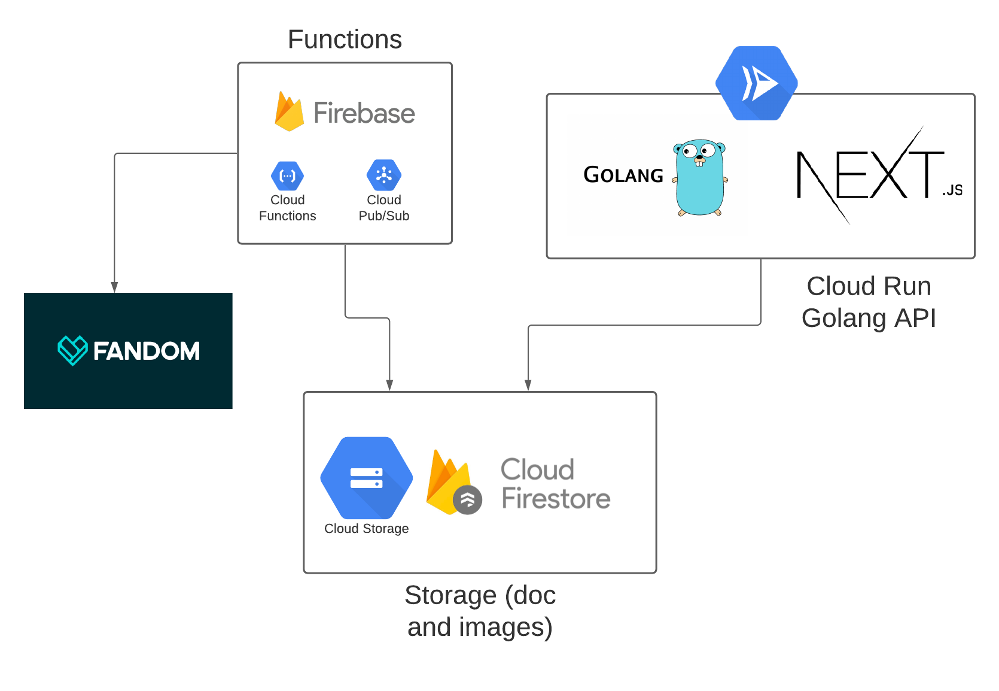

# My Hero Academia API

[My hero Academia API](https://myheroacademiaapi.com/) is a RESTful API to get get characters from anime [My Hero Academia.](https://pt.wikipedia.org/wiki/Boku_no_Hero_Academia)

## Documentation and Getting Started

You can get started follow the [documentation.](https://myheroacademiaapi.com/docs)

## Project Structure

  

**Functions:** Firebase functions to get data from fandom and store in Cloud Storage and Cloud Firestore.
**Storage:** Firestore to store docs and Cloud Storage to store images downloaded.
**Cloud Run:** To run container with Golang, running [GoFiber](https://github.com/gofiber/fiber) with static files provides by [Next.JS](https://github.com/vercel/next.js/)
